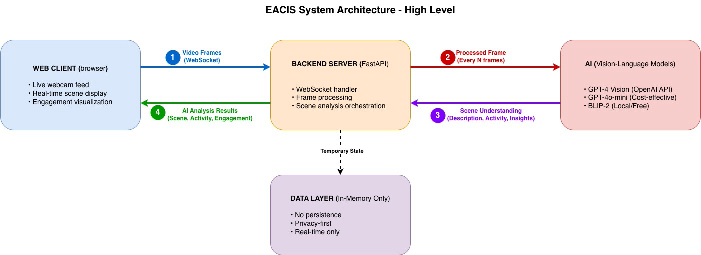

# Emotional AI Classroom Insight System (EACIS) - MVP

A real-time AI-powered classroom scene understanding and engagement tracking system.
[Link to the Presentation
](https://www.canva.com/design/DAG6iwRcjmk/IpbGY2mvAwHFVwpTUHTr3g/edit?utm_content=DAG6iwRcjmk&utm_campaign=designshare&utm_medium=link2&utm_source=sharebutton)

## 💡 Motivation

Understanding how students engage collectively during classroom activities provides educators with critical insights into the learning process. This awareness enables continuous improvement of teaching methodologies and helps students develop more effective learning strategies, ultimately leading to better educational outcomes.

## 🎯 Overview

EACIS uses advanced vision-language AI models to understand classroom activities in real-time. The system captures video, analyzes scenes with AI, and provides natural language insights and engagement metrics through an intuitive dashboard.

## ✨ Features

- **AI Scene Understanding**: Uses GPT Vision capable models or BLIP-2 to analyze classroom activities with natural language descriptions
- **Natural Language Insights**: AI generates human-readable descriptions of student activities and behaviors
- **Activity Classification**: Automatically identifies activities (note_taking, group_discussion, lecture_listening, etc.)
- **Engagement Scoring**: AI-driven engagement assessment based on visual scene analysis
- **Live Dashboard**: Beautiful, responsive UI built with React and shadcn/ui
- **WebRTC Video Capture**: Direct browser-to-server video streaming
- **Privacy-First**: No images stored, all processing done in memory
- **Real-time Updates**: WebSocket connection for instant feedback
- **Flexible AI Providers**: Support for GPT-4 Vision, GPT-4o-mini, or local BLIP-2 models

## 🏗️ Architecture



### System Flow

1. **Video Frames** → Web client captures video via webcam and sends frames to backend via WebSocket
2. **Frame Processing** → Backend processes every Nth frame to optimize performance
3. **AI Analysis** → Vision-Language Models (GPT-4 Vision/BLIP-2) analyze scenes and generate insights
4. **Results Delivery** → AI analysis results (scene description, activity, engagement) sent back to client via WebSocket

### Components

### Frontend
- **Framework**: React 18 + TypeScript
- **Build Tool**: Vite
- **UI Library**: shadcn/ui + TailwindCSS
- **Charts**: Recharts
- **Video**: WebRTC API
- **Communication**: WebSocket

### Backend
- **Framework**: FastAPI (Python 3.11+)
- **AI Models**: GPT-4 Vision, GPT-4o-mini, or BLIP-2 (vision-language models)
- **Scene Analysis**: Natural language understanding of classroom activities
- **Computer Vision**: OpenCV for frame processing
- **Communication**: WebSocket

## 📁 Project Structure

```
SOFT TECH 1/
├── frontend/
│   ├── src/
│   │   ├── components/
│   │   │   ├── ui/              # shadcn/ui components
│   │   │   ├── WebcamFeed.tsx   # Webcam capture component
│   │   │   ├── EmotionDisplay.tsx
│   │   │   └── EngagementChart.tsx
│   │   ├── pages/
│   │   │   └── Dashboard.tsx     # Main dashboard
│   │   ├── lib/
│   │   │   └── websocket.ts      # WebSocket client
│   │   ├── App.tsx
│   │   └── main.tsx
│   ├── package.json
│   ├── vite.config.ts
│   ├── tailwind.config.js
│   └── tsconfig.json
│
└── backend/
    ├── app/
    │   ├── main.py               # FastAPI application
    │   ├── ws/
    │   │   └── emotion_ws.py     # WebSocket handler
    │   ├── services/
    │   │   └── scene_service.py  # AI scene understanding
    │   └── utils/
    │       └── frame_utils.py    # Frame processing
    └── requirements.txt
```

## 🚀 Getting Started

### Prerequisites

- **Python**: 3.11 or higher
- **Node.js**: 18 or higher
- **npm**: 9 or higher
- **Webcam**: Required for video capture

### Backend Setup

1. **Navigate to backend directory**:
   ```bash
   cd "backend"
   ```

2. **Create virtual environment**:
   ```bash
   python3 -m venv venv
   ```

3. **Activate virtual environment**:
   ```bash
   # macOS/Linux
   source venv/bin/activate
   
   # Windows
   venv\Scripts\activate
   ```

4. **Install dependencies**:
   ```bash
   pip install -r requirements.txt
   ```

5. **Configure AI Provider** (optional):
   ```bash
   # For GPT-4 Vision (requires API key)
   export OPENAI_API_KEY="your-api-key"
   export SCENE_PROVIDER="gpt4_vision"  # or "gpt4o_mini" (cheaper)
   
   # For local BLIP-2 (free, requires GPU)
   export SCENE_PROVIDER="blip2_local"
   ```

6. **Run the backend server**:
   ```bash
   uvicorn app.main:app --reload --host 0.0.0.0 --port 8000
   ```

   The backend will start at `http://localhost:8000`

### Frontend Setup

1. **Open a new terminal and navigate to frontend directory**:
   ```bash
   cd "frontend"
   ```

2. **Install dependencies**:
   ```bash
   npm install
   ```

3. **Start the development server**:
   ```bash
   npm run dev
   ```

   The frontend will start at `http://localhost:3000`

### Accessing the Application

1. Open your browser and go to `http://localhost:3000`
2. Click "Start Camera" to begin video capture
3. Position yourself in front of the camera
4. Watch real-time emotion detection and engagement tracking

## 📊 AI Scene Analysis

The system uses AI to analyze classroom scenes and provides:

| Output | Description | Example |
|--------|-------------|----------|
| Scene Description | Natural language description | "Student is actively taking notes during lecture" |
| Activity | Classified activity type | note_taking, group_discussion, lecture_listening |
| Engagement Level | Qualitative assessment | very_high, high, medium, low, very_low |
| Engagement Score | Numerical score (0.0-1.0) | 0.85 |
| Behavioral Insights | List of observations | ["Active learning behavior", "Good attention"] |
| Recommendation | Teacher action suggestion | "No intervention needed" |

## 🔧 Configuration

### Backend Configuration

- **Host**: `0.0.0.0` (change in `app/main.py`)
- **Port**: `8000` (change in `app/main.py`)
- **Frame Size**: Max 640px width (change in `utils/frame_utils.py`)

### Frontend Configuration

- **WebSocket URL**: `ws://localhost:8000/ws/emotion` (change in `pages/Dashboard.tsx`)
- **Port**: `3000` (change in `vite.config.ts`)
- **Frame Capture Rate**: 500ms / 2 FPS (change in `components/WebcamFeed.tsx`)

## 🛠️ Development

### Running Tests

Backend:
```bash
cd backend
pytest
```

Frontend:
```bash
cd frontend
npm run test
```

### Building for Production

Frontend:
```bash
cd frontend
npm run build
```

The build output will be in `frontend/dist/`


## 📝 API Documentation

### WebSocket Endpoint

**URL**: `ws://localhost:8000/ws/emotion`

**Client sends**:
```json
{
  "frame": "data:image/jpeg;base64,/9j/4AAQSkZJRg..."
}
```

**Server responds**:
```json
{
  "scene_description": "Student is actively taking notes during lecture",
  "activity": "note_taking",
  "engagement_level": "high",
  "engagement": 0.85,
  "student_count": 1,
  "behavioral_insights": [
    "Active learning behavior",
    "Good attention management"
  ],
  "teacher_recommendation": "No intervention needed",
  "timestamp": 1730707200,
  "provider": "gpt4_vision"
}
```

### REST Endpoints

- `GET /` - Health check
- `GET /health` - Service health status

## 🤝 Contributing

Future enhancements could include:
- Session analytics and reports
- Historical data storage
- Real-time engagement alerts
- Teacher dashboard
- Additional AI providers (Gemini, Claude Vision)

## 📄 License

This project is for educational purposes as part of MSc Software Technology coursework.

## 👥 Authors

Emanuel Nzinga Maimona
ELTE MSc 
Software Technology I

---

**Note**: This MVP is designed for local development and testing. Additional security measures and optimizations are required for production deployment.
